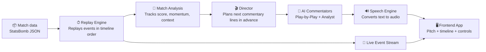
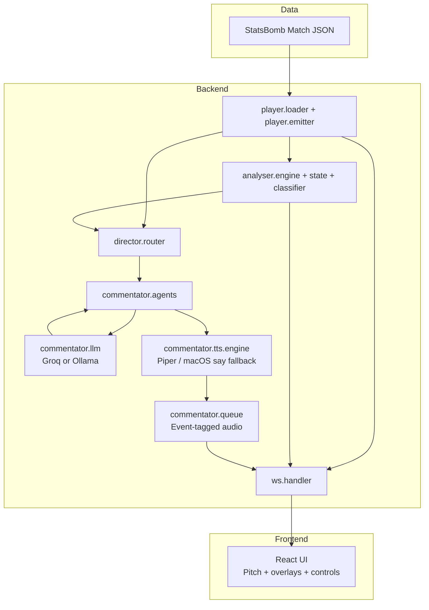

# MatchCaster

A multi-agent AI football commentary system. Replays real StatsBomb match data with live synthesized audio commentary from two AI commentators, displayed on an interactive pitch visualizer.



**In plain words:** MatchCaster reads a real match file, "replays" the game second by second, prepares commentary slightly ahead of time, converts it to audio, and sends both visuals + sound to the live interface.

---

## Quick Start

### 1) Prerequisites
- Python 3.11+
- Node.js 18+

Optional:
- Groq API key (default cloud mode)
- Ollama (for fully local mode)

### 2) Install dependencies (standard workflow)

```bash
# from repo root
python3 -m venv .venv
source .venv/bin/activate

python -m pip install --upgrade pip
python -m pip install -r backend/requirements.txt

cd frontend && npm install && cd ..
cd data && bash setup.sh && cd ..
```

### 3) Run

```bash
# Cloud mode (default)
export GROQ_API_KEY=your_key_here
./start.sh

# Local mode (offline)
# brew install ollama
# ollama pull gemma2:2b-instruct-q4_K_M
./start.sh local
```

Open http://localhost:5173

---

## Commands

```bash
./start.sh          # cloud (groq, default)
./start.sh groq     # explicit cloud
./start.sh local    # local ollama
```

---

### Notes

- Backend deps: `backend/requirements.txt` (Python / pip)
- Frontend deps: `frontend/package.json` (Node / npm)
- `start.sh` can auto-create `.venv`, but explicit venv setup above is the standard manual flow.

## Using the app

1. **Select a match** — the launch screen appears automatically. Pick a match, choose a commentary style, then click **Watch Live →**.

2. **Controls** — the video player bar at the bottom:
   - `▶ / ⏸` — play and pause
   - `−30s` `−10s` `+10s` `+30s` — jump backward or forward
   - Click the **seek bar** to jump to any point in the match
   - Speed buttons `0.5× 1× 2× 4× 8×` — control replay speed
   - `🔊` — mute/unmute audio commentary
   - `⚙` — open the **Overlay Panel** (pitch view and settings)
   - **Change** — go back to the match selection screen

3. **Overlay Panel** (opened with `⚙`):
   - **Live** — real-time event markers and pass trails on the pitch
   - **Formation** — starting lineup with jersey numbers and player names
   - **Heatmap** — territory map for home or away team
   - **Shots** — all shot locations, sized by xG, colored by outcome
   - **Build-up** — directional pass flow arrows by zone

4. **Sidebar tabs**:
   - **Stats** — momentum bar, possession, shots, xG, passes, fouls, cards
   - **Live** — key events feed (goals, cards, big chances) or full event log
   - **Squad** — starting lineup with positions and goal contributions

5. **Commentary styles**:
   | Style | Character |
   |---|---|
   | 🎙 Neutral | Balanced, professional |
   | 🔥 Enthusiastic | High energy, emotional |
   | 📐 Analytical | Tactical depth, data-driven |
   | 🏠 Home Fan | Biased toward the home side |
   | ✈️ Away Fan | Biased toward the away side |

---

## Architecture

### Commentary System

### System Overview (non-technical)

Think of MatchCaster like a live TV production team:

- **Replay Engine** = the control room replaying the match timeline
- **Director** = decides *when* each commentator should speak
- **AI Commentators** = the voices (live action + deeper analysis)
- **Speech Engine** = turns scripts into spoken audio
- **Frontend** = what the viewer sees and hears in real time

### Technical Flow



MatchCaster uses a two-commentator look-ahead batch system:

1. The **Director** pre-generates commentary for the next 30 game-seconds of upcoming events (before they happen on the pitch).
2. Each line is tagged to a specific event ID and TTS audio is synthesized in advance.
3. When an event fires on the pitch, its pre-synthesized audio plays immediately — perfectly synced.

**Play-by-Play commentator** — narrates the action. Fires every 30 game-seconds. Receives analyst context to weave into narration. Handles the opening scene-setter.

**Analyst commentator** — expert macro insights. Fires every 5-7 game-minutes, on substitutions, and 2 minutes after goals. Silent during the first 5 minutes (PBP owns the opening). Feeds context back to PBP.

### File Structure

```
backend/
├── config.py                All tunables
├── main.py                  FastAPI app + HTTP routes
│
├── player/
│   ├── clock.py             Async accelerated match clock (50 ms ticks)
│   ├── loader.py            StatsBomb JSON → MatchEvent dataclasses
│   └── emitter.py           Replay session management + seek support
│
├── analyser/
│   ├── classifier.py        Event priority: critical / notable / routine
│   ├── state.py             SharedMatchState (score, possession, stats)
│   ├── engine.py            Real-time match analysis (momentum, xG, vectors)
│   ├── spatial.py           Coordinate → pitch zone descriptions
│   └── enrichment/
│       ├── match_meta.py    Stadium, date, manager lookup
│       ├── weather.py       Historical weather via Open-Meteo
│       └── team_colors.py   Kit colors for ~40 teams
│
├── director/
│   └── router.py            Orchestrator: look-ahead batch scheduler,
│                            analyst scheduler, event dispatch
│
├── commentator/
│   ├── agents/
│   │   ├── base.py          BaseAgent ABC + prompt assembly
│   │   ├── play_by_play.py  Live action narration (batch JSON output)
│   │   ├── analyst.py       Expert macro commentary (replaces tactical+stats)
│   │   └── prompts.py       System prompts + user prompt builders
│   ├── llm/
│   │   ├── __init__.py      Backend singleton (get_backend / init_backend)
│   │   ├── backend.py       LLMBackend ABC
│   │   ├── groq.py          Groq cloud backend (OpenAI-compatible SSE)
│   │   └── ollama.py        Ollama local backend
│   ├── tts/
│   │   ├── engine.py        Piper TTS wrapper → WAV bytes (+ macOS say fallback)
│   │   └── voices.py        Agent → voice model mapping
│   └── queue.py             AudioQueue + EventTaggedQueue (event-ID dispatch)
│
└── ws/
    └── handler.py           WebSocket session: events, audio, state, seek
```

---

## Configuration

All tunables live in `backend/config.py`:

| Key | Default | Description |
|---|---|---|
| `DEFAULT_SPEED_MULTIPLIER` | `1.0` | Replay speed on startup |
| `LLM_BACKEND` | `groq` | `"groq"` (cloud) or `"local"` (Ollama) |
| `GROQ_MODEL` | `llama-3.1-8b-instant` | Groq model |
| `OLLAMA_MODEL` | `gemma2:2b-instruct-q4_K_M` | Ollama model (local mode only) |
| `OLLAMA_TIMEOUT_SEC` | `90.0` | Per-call timeout for Ollama streaming |
| `MAX_OUTPUT_TOKENS` | `50` | Hard token cap per commentary batch |
| `PBP_BATCH_WINDOW_MIN_SEC` | `30.0` | Minimum look-ahead window (game-sec) |
| `PBP_BATCH_WINDOW_MAX_SEC` | `90.0` | Maximum look-ahead window at high speed |
| `ANALYST_MIN_GAP_GAME_SEC` | `300.0` | Minimum silence between analyst firings |
| `ANALYST_BLOCK_FIRST_SEC` | `300.0` | Analyst blocked for first 5 game-minutes |
| `GOAL_ANALYST_COOLDOWN_SEC` | `120.0` | Analyst cooldown after a goal |
| `MAX_EVENTS_PER_BATCH` | `8` | Max events sent to LLM per batch |

---

## Graceful degradation

| Failure | Fallback |
|---|---|
| LLM unavailable / slow | Template commentary ("Shot — great save!") |
| Piper TTS not installed | macOS `say` built-in voices |
| Piper TTS crashes | macOS `say` built-in voices |
| Audio queue overflow | Oldest items dropped |
| WebSocket disconnect | Auto-reconnect after 2 s |
| Unknown match ID | No metadata shown, colors use defaults |